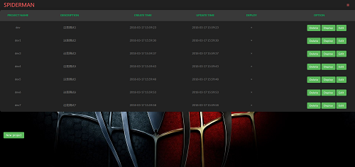

# SpiderMan 
<a href="EN_README.md">English</a> | <a href="README.md">中文</a><br>
## table of Contents  
* [statement](#statement)  
* [BackgroundIntroduction](#BackgroundIntroduction)  
* [ProjectIntroduction](#ProjectIntroduction)  
* [Instructions](#Instructions)  
  * [GetCode](#GetCode)  
  * [UseAnEexample](#UseAnEexample)  
       * [InterfaceIntroduction](#InterfaceIntroduction)  
       * [InterfaceStyle](#InterfaceStyle)
       * [deploy](#deploy)  
* [Other](#Other)  
  
<a name="statement"></a>  
## statement   
*SpiderMan*pages are a lot of use <a href="http://image.baidu.com/">百度图片</a>Untagged copyrighted pictures, please contact me if you are suspected of infringement.
<a name="Background introduction"></a>  
## BackgroundIntroduction 
*SpiderMan* Based on Scrapy, scrapyd, scrapy-API, tornado spider distributed management framework.<br/>  
*SpiderMan* Features include spider scheduling, Web side SSH, Web end code editor and Scrapy project construction and so on. 
  
<a name="Project Introduction"></a>  
## ProjectIntroduction 
*SpiderMan* is designed to provide a convenient and distributed crawler management framework<br>  
*SpiderMan* is developed on the basis of scrapyd API, and does not make any intrusion to existing crawler code<br>
*SpiderMan* is embedded in the web editor so that you can write code, publish code, deploy new crawler projects to a specified server in web pages<br>
*SpiderMan* At present, only tornado.ioloop.PeriodicCallback is used to complete the timing task, and a single spider is scheduled for regular scheduling<br>
  
  
<a name="Instructions"></a>  
## Instructions  
  
<a name="Get code"></a>  
### GetCode  
  
* github Project Home: <https://github.com/QYLGitHub/SpiderMan>  
  
  
<a name="UseAnEexample"></a> 
 ## UseAnEexample
#### InterfaceIntroduction
* HOME:  Because I really don't know what to put a few things on the front page, but if there is no home page, I always feel strange!<br>   
* SERVER:  It is mainly used for the management of scrapyd servers, including: adding new servers, scheduling server specified spiders, deleting the items of the designated servers, and the Web Ssh. of the server.
* PROJECT: The new local project is deployed to the specified server. This page includes: adding new projects, deleting items, editing project code, and deploying projects
* There are also some subpages...
#### InterfaceStyle
* HOME <br> 
* SERVER <br> 
* PROJECT<br>

#### deploy
```
clone project to local
git clone https://github.com/QYLGitHub/SpiderMan.git
cd SpiderMan
python setup.py install
# init project
SpiderMan init
# Appoint host,port 
SpiderMan runserver [host:port]
# Create an administrator account
SpiderMan admin

```

#### Other
Because my programming level is limited, and I am developing alone,<br>
the page is not internationalized, the timing task is too simple, and so on. A series of problems,<br>
 if friends have better ideas, better implementations, or find bug. welcome fork modification! <br>
Finally, I wish you a happy life! <br>
